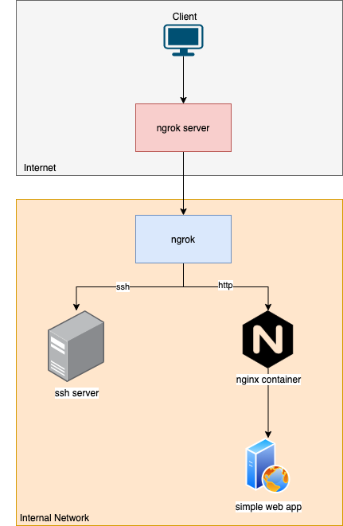
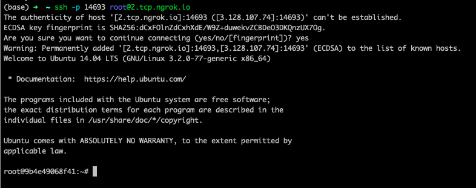

# ngrok-docker

Simple example for [ngrok](https://ngrok.com/) and docker-compose.

Config:

- [ngrok](ngrok.yml): config authtoken to communicate with ngrok server
- [nginx.conf](nginx-conf/nginx.conf): config nginx.config if you want ngint route request to another server
- [public-key](ssh-server/public_key): if you want to use `ssh-server`, you must provide `public-key` for `ssh-server` to authenticate.

Result:

- http tunnel
  
- ssh tunnel
  

Blog: https://thinhdanggroup.github.io/ngrok-docker/